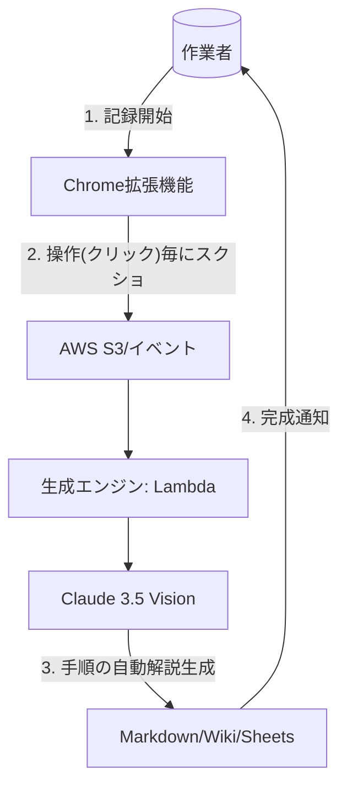

# 手順書自動化 — ツール化設計（Tooling Design）
_作成: 2026-02-23 / フェーズ: 方式選定・アーキテクチャ設計_

現場の作業者が「プログラムの知識なし」で、日常業務の中で自然に手順書を作成・蓄積できるための「ツールの形（UI/UX）」を定義します。

---

## 1. ツール化のコンセプト
**「記録を意識させない、ワンクリック・ランブック」**
- 作業者は「記録開始」を押して普段通り作業するだけ。
- 特殊なプログラミングや、手動でのスクショ貼り付けを一切排除する。

---

## 2. 推奨される3つの「ツールの形」

現場の環境に応じて、以下の 3 つの形態から選択、または組み合わせて提供します。

| 形態 | 実装方法 | メリット | デメリット |
|------|---------|----------|-----------|
| **A. ブラウザ拡張機能** | Chrome / Edge 拡張 | AWSコンソール等のWeb操作に最適。クリック毎の自動スクショが可能。 | Webブラウザ内の操作に限定される。 |
| **B. デスクトップ常駐型** | .NET / Electron | Windowsアプリ（基幹システム等）の操作も記録可能。ホットキーで操作。 | PCへのインストール権限が必要。 |
| **C. 共有フォルダ監視型** | Python / AWS Lambda | スマホや外部キャプチャ等、「画像を送るだけ」でドキュメント化。 | 「自動撮影」はできない。 |

### 【推奨案】 ブラウザ拡張機能 ＋ クラウド解析
AWSコンソールの操作ログを自動化する場合、**「ブラウザ拡張機能」**が最も低コストかつ高機能です。

---

## 3. ツール化アーキテクチャ（ブラウザ拡張案）

### ステップ詳細
1.  **キャプチャ層**: 作業者がブラウザで「記録開始」をオン。クリックやページ遷移を検知して自動でスクショを撮影。
2.  **イベント蓄積層**: 撮影した画像を順次 AWS S3 にアップロード。
3.  **AI解析層（心臓部）**: 1つ1つの画像に対し、「何が設定されたか」を AI が言語化。
4.  **編集・出力層**: 最終的に 1 つのドキュメントにまとめ、社内の Wiki や Google Sheets に自動投稿。

---

## 4. ツール導入のステップ（ロードマップ）

### Step 1: 開発者向けプロトタイプ（完了済）
- 私が作成した CLI ツールを使用して、AI の「解説精度」を検証。
- ユーザー様が手動でスクショを撮り、AI に読み込ませて精度を確認。

### Step 2: 社内配布用「簡易キャプチャ・プラグイン」
- ブラウザ上のクリックでパシャパシャと画像を保存するだけの、シンプルな拡張機能を作成。
- これを数名のテスターに配布し、実際に「作業しながら撮る」フローをテスト。

### Step 3: フルオート・プラットフォーム（Scribe/Tango の社内版）
- UI を整備し、誰でも使える Web ポータルとしてリリース。
- 作成された手順書が自動的に「社内ナレッジベース」へ蓄積される環境を実現。

---

## 5. 他の商用ツール（Scribe, Tango 等）との違い
- **機密性**: 外部ツールにスクショを送らず、自社の AWS 環境（Bedrock）内で完結できる。
- **カスタマイズ性**: 自社専用の用語集や、指定のスプレッドシート形式に 100% 合わせられる。
- **コスト**: ライセンス料ではなく、従量課金（1件数円）のみで運用可能。

---
_参照: [02_推奨アーキテクチャ.md](./02_推奨アーキテクチャ.md) / [04_PoC設計.md](./04_PoC設計.md)_
